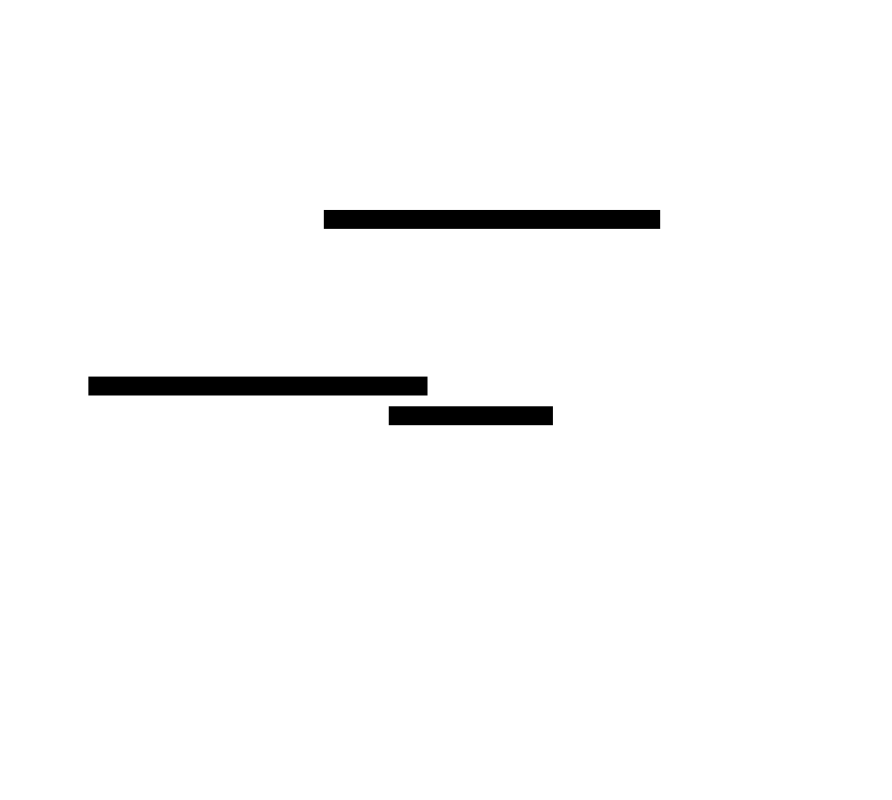

# Keep Live Transcription Continuous Across Interim Final Results

## Diagram

## Context

Current STT behavior in `SttLive` treats an incoming `final` event as a terminal session boundary by clearing `session_id` and turning off `recording`. In practical use this causes transcript updates to stop mid-session, even when the user is still actively recording and speaking.

This change isolates and fixes session lifecycle semantics:
- `final` is an interim transcript signal, not an implicit stop command.
- session ownership remains with the active LiveView session until explicit stop or error.

## Goals / Non-Goals

**Goals:**
- Preserve the active STT session across `final` events.
- Continue accepting and forwarding `audio_chunk` messages after `final`.
- Continue updating transcript on subsequent `partial`/`final` events for the same session.
- Keep indicator and status behavior consistent with active recording state.
- Add regression tests for post-`final` continuation.

**Non-Goals:**
- Redesign STT worker protocol.
- Introduce multi-session multiplexing in one LiveView instance.
- Change AI + TTS orchestration behavior beyond what is needed for session continuity.

## Decisions

### 1) `final` does not close the session
`handle_info` for STT `final` will update transcript/status but MUST NOT clear `session_id` or set `recording` false when the session is still active.

**Alternative considered:** Keep current terminal interpretation of `final` and require worker/browser to reopen sessions.
- Rejected due to poor UX, unnecessary churn, and mismatch with observed user workflow.

### 2) Stop conditions remain explicit
Session termination remains only in explicit stop and error paths:
- `handle_event("stop_stream", ...)`
- `handle_event("audio_error", ...)`
- `handle_info` STT `error`

**Alternative considered:** infer stop from inactivity or repeated `final`.
- Rejected for ambiguity and risk of premature termination.

### 3) Guard by session_id matching
Only STT events whose `session_id` matches `socket.assigns.session_id` affect transcript/state. This keeps events deterministic when stale or cross-session messages arrive.

**Alternative considered:** accept latest event regardless of session ID.
- Rejected due to race risk and transcript contamination.

### 4) On Air activity is tied to recording/session lifecycle
`final` may clear active speaking detection, but must not imply disabled STT. Indicator enablement follows `recording == true`.

**Alternative considered:** auto-disable indicator on every `final`.
- Rejected; conflicts with continuous-recording semantics.

## Risks / Trade-offs

- **[Risk] Lingering session on missing explicit stop** → **Mitigation:** retain existing error handlers and ensure stop paths still call port `stop_session`.
- **[Risk] Status text confusion (`done` while still recording)** → **Mitigation:** normalize status to recording-compatible wording after `final` or on next partial.
- **[Risk] Regressions in transcript-edit UX** → **Mitigation:** add focused tests for event handling precedence and same-session updates.

## Migration Plan

1. Update `SttLive` `final` event handling to preserve active session/recording state.
2. Adjust status messaging to avoid misleading terminal wording during active capture.
3. Add regression test(s) proving partial/final updates continue after a final.
4. Run `mix test` and `./precommit.sh`.

Rollback strategy: restore prior `final` event branch behavior if regressions surface; isolated to `SttLive` event handling.

## Open Questions

- Should `status` on `final` be `"recording"`, `"finalized segment"`, or a dedicated non-terminal message?
- Do we also want to make AI+Speak async in this same change, or keep scope strictly on session continuity?
